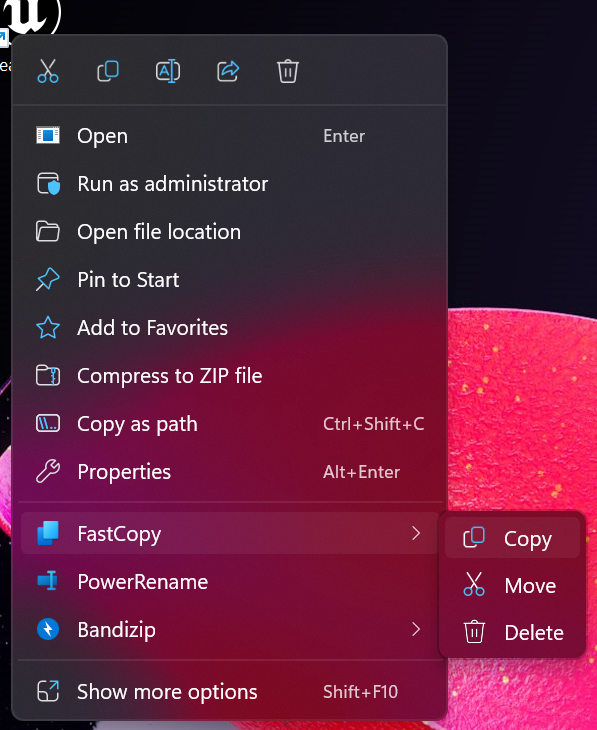
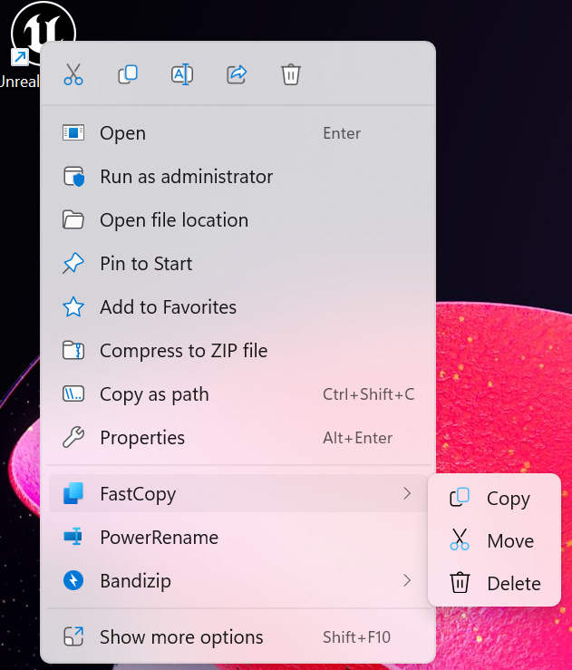
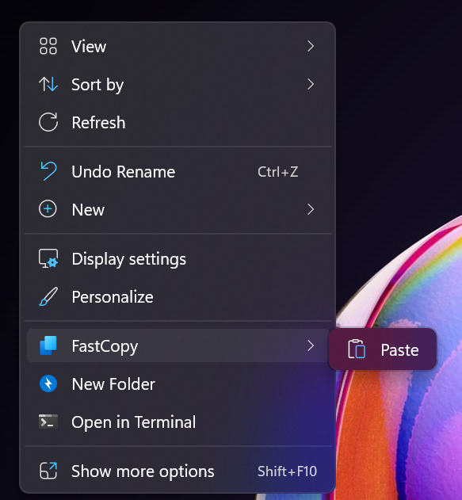
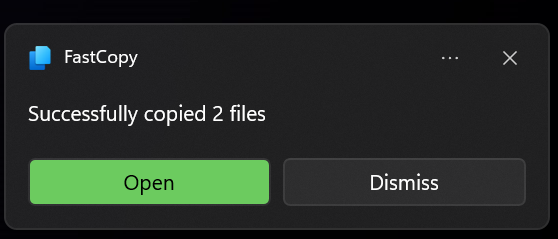

#   FastCopy

A GUI wrapper for Windows' built-in `robocopy` ~~and `xcopy`~~.

## Features
- Easy to use copy/paste/move/delete dialog, just like your good old explorer, but much faster🚀

- Support the new Windows 11 context menu, and the old windows context menu, with the fluent design icon adapted to Light/Dark theme






- Integration with Windows Notification Center: a notification toast will pop up when the copy is finished


- Integration with taskbar: a progress bar sync with the one inside the window

<p align="center">
    <image src="Screenshots/taskbar-icon.png">
</p>

- Multi-language support
  + English
  + 中文

## Usage
1. Using file explorer, select some files/folders, as many as you want >> right click >> move to **FastCopy** >> select **Copy** or **Move**
2. Go to destination folder, right click at empty space >> move to **FastCopy** >> select **Paste**

## Development
### Project structure
```
FastCopy
    FastCopy\               --- Main project
    FastCopyShellExtension\ --- A dll project for registering the new Windows context menu
    SpeedTest\              --- A speed test project for measuring various copying method under Windows
    UnitTest\               --- Unit test for above projects
    FastCopy.sln            --- The solution file for all the projects
```
### Build pre-requisites
- Visual Studio 2019+, with C++20 support & Universal Windows development workload
- Windows App Sdk, with C++ template
- Additional dependencies per project:
  + FastCopy:
    - spdlog
  + SpeedTest:
    - abseil

[vcpkg](https://vcpkg.io/en/) is the recommended package manager to handle these dependencies. 
You can install them with one command, and do no more.
```
vcpkg install spdlog:x64-windows
vcpkg install abseil:x64-windows
``` 


### Prototype
[Figma link, you may need to ask for permission.](https://www.figma.com/file/e5hUvDWKO8gZiKXruuNSvL/Xcopy?type=design&node-id=217-31199&t=cKY9TdBJXXi7QdFL-0)


