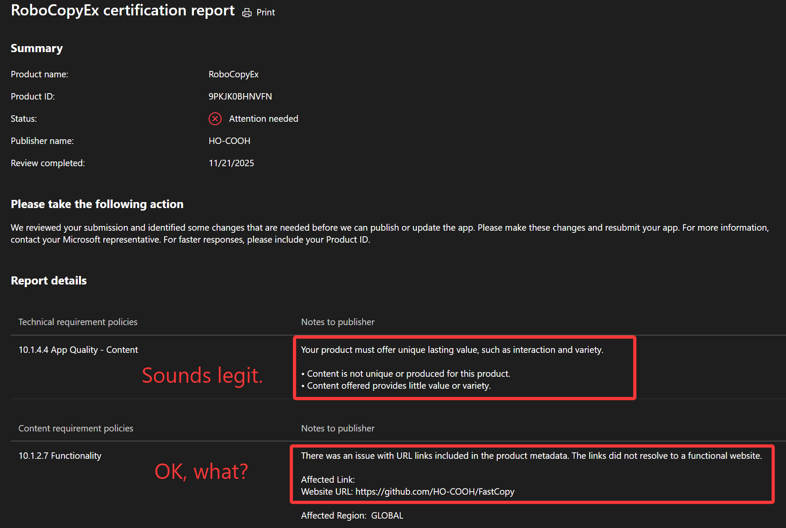

## ⚠️ WARNING ⚠️
**MY SUBMISSION TO MICROSOFT STORE IS GETTING REJECTED FOR NO OBVIOUS REASON. BLAME THEM FOR ALL CONSEQUENCES.**

I am very **UPSET** about the whole Microsoft business and eco-system, especially about WinUI and WASDK team. 
I do all these things just out of plain enthusiasm, and there **IS** a limit for that. 
I, myself alone, raised 100+ issues to [the WinUI repro](https://github.com/HO-COOH/FastCopy) and majority of them have been ignored for years.

Some funny reasons for rejection:
